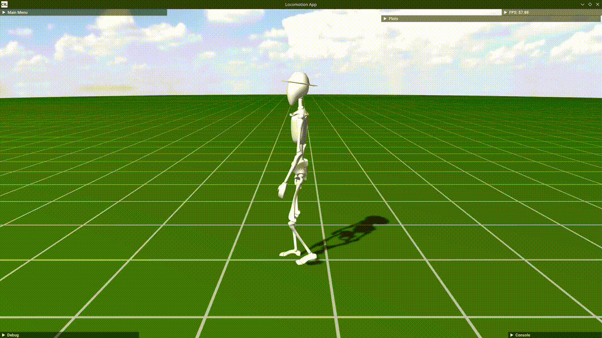

# procedural-locomotion

Code base for the project: Procedural Locomotion Engine For Digital Humans.

## Getting started

We recommend [JetBrains CLion](https://www.jetbrains.com/clion/) for the development.
It is a paid software, but JetBrains has the [student plan](https://www.jetbrains.com/community/education/#students)
that provides free licenses. See [this](https://www.jetbrains.com/help/clion/clion-quick-start-guide.html) for a quick
start guide.

1. Fork this repository and download the code.

2. Install [Google Ceres](http://ceres-solver.org/installation.html)

3. Build the project (or build `locoApp`). You can build the project in cmake Release mode for realtime performance:
   see [this](https://www.jetbrains.com/help/clion/cmake-profile.html) for a guide about cmake profile for CLion.

4. Run the `locoApp`.

5. Select a model to play with: `Main Menu > Character > Model`. We have `Bob` and `Running Bob` for examples.


6. Press the space bar to play the app. You can give joystick command with arrow keys in your keyboard. 


## Results

Walking in a straight line



Walking along a curved trajectory


Running


Walking on uneven terrain


## Installing Google Ceres

### Windows
#### Visual Studio (tested)
Download [ceres-windows](https://github.com/tbennun/ceres-windows) and follow the given install instructions there.
It might be necessary to copy the files `ceres.dll`, `ceres.exp`, `ceres.lib`, `ceres.pdb`, `ceres_staci.lib`,
`ceres_static.pdb`, `libglog_static.lib` and `ligglog_static.pdb` from the ceres-windows compilation folder into the 
compilation folder of this project, i.e. the folder from which `locoApp.exe` will be executed.

#### Visual Studio with Vcpkg (tested)
[Vcpkg](https://github.com/microsoft/vcpkg) is the homebrew equivalent on Microsoft Windows and can be used to install ceres solver.
After cloning and installing, please note that vcpkg would install x86 libraries by default, run either of the following to install x64 ceres:


```cmd
.\vcpkg\vcpkg install ceres:x64-windows
```

Or

```cmd
.\vcpkg\vcpkg install ceres --triplet=x64-windows
```
Then, you can open the CMake Settings Editor in Visual Studio, and under CMake toolchain file, add the path to the vcpkg toolchain file:
```cmd
[vcpkg root]/scripts/buildsystems/vcpkg.cmake
```
### Linux

#### Ubuntu (untested)
Download the [latest release](http://ceres-solver.org/installation.html) as a `tar.gz` archive.
Install the necessary build dependencies and build the project, as outlined in the download instructions.


#### Arch (tested)
Either install from the AUR by cloning [this URL](https://aur.archlinux.org/ceres-solver-git.git) and run `makepkg -si` on the 
resulting directory, or use `yay ceres-solver` and install the recommended package.


